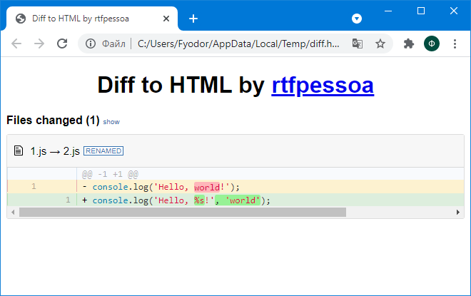
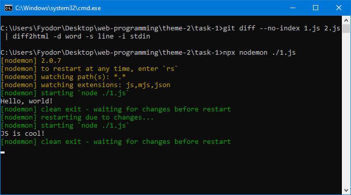

### Тема 2. Основы современного JavaScript (ECMAScript 2016, ECMAScript 2017): синтаксис, структуры данных и функциональный стиль программирования

#### I. Развёртывание и настройка папки проекта и приложений для управления JavaScript-проектом и мониторинга зависимостей

1. Создание проекта

```
npm init -y
```

2. Установка diff2html-cli

```
npm -i -D diff2html-cli
```

3. Установка nodemon

```
npm i -D nodemon
```

4. Выполнение diff2html

```
git diff --no-index 1.js 2.js | diff2html -d word -s line -i stdin
```



5. Автоматизация перезапуска сценария с помощью nodemon

```
npx nodemon ./1.js
```



#### II. Часть А. Разработка веб-сценария, содержащего решение линейной системы уравнений методом Крамера

https://kodaktor.ru/be60b94

```
0.68 0.44
```

#### Часть Б. Разработка веб-сценария в функциональном стиле JavaScript с использованием условного (тернарного) оператора

[Часть 1](task-2/ternary-operator.html)

```
yes
```

[Часть 2](task-2/ternary-operator_2.html)

```
=NaN
```

