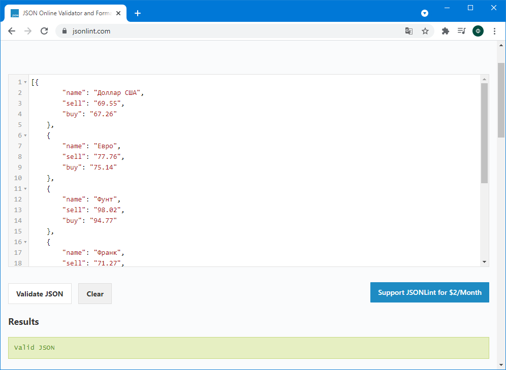
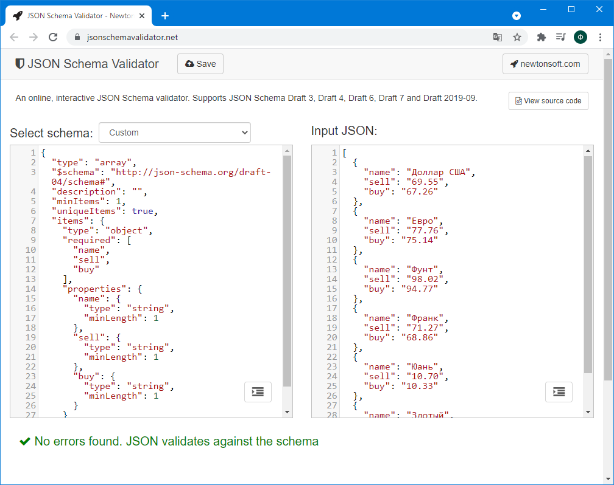
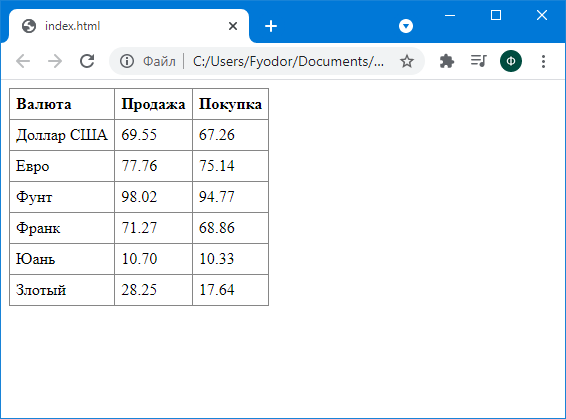

### Тема 3. Элементы асинхронного и событийно-ориентированного клиентского веб-программирования

#### Часть 1

Линтинг JSON-документа



Валидация JSON-документа относительно схемы



Вывод курсов валют в виде таблицы



https://kodaktor.ru/g/ecf46f1

Код приложения (фрагмент script):

```javascript
(async () => {
    let response = await fetch('https://kodaktor.ru/j/rates');
    data = await response.json();
    data.forEach(price => {
        document.querySelector('tbody').innerHTML += `<tr><td>${price.name}</td><td>${price.sell}</td><td>${price.buy}</td></tr>`;
    });
})();
```

#### Часть 2

https://kodaktor.ru/g/6427f56

